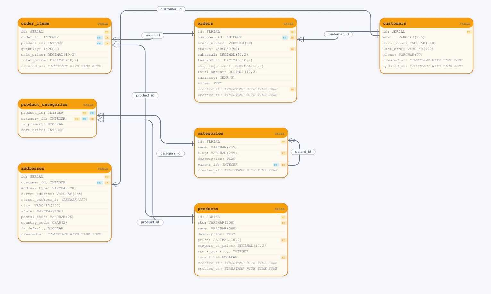
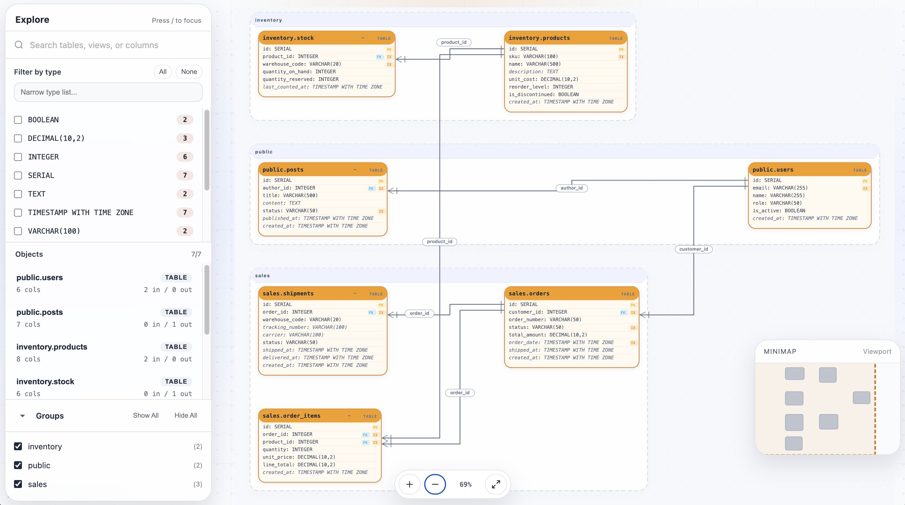

<p align="center">
  
</p>

<h1 align="center">Relune</h1>

<p align="center">
  Understand, visualize, and review database schemas.
</p>

<p align="center">
  Relune turns SQL DDL and live database metadata into diagrams, diagnostics, diffs, and exportable schema artifacts for documentation, code review, and automation.
</p>

<p align="center">
  <a href="https://mhiro2.github.io/relune/">Playground</a> ·
  <a href="#quick-start">Quick start</a> ·
  <a href="#installation">Installation</a> ·
  <a href="docs/getting-started.md">Getting started</a> ·
  <a href="docs/cli-reference.md">CLI reference</a>
</p>

<p align="center">
  <a href="https://deepwiki.com/mhiro2/relune"></a>
  <a href="../../releases"></a>
  <a href="../../actions/workflows/ci.yaml"></a>
  <a href="./LICENSE"></a>
</p>

---

## Why Relune

Relune goes beyond static ERDs.

It helps you work with schema structure across the full lifecycle:

- **Visualize** tables, views, relationships, and enums
- **Inspect** schema shape from SQL or live databases
- **Export** review-friendly text formats for docs and pull requests
- **Lint** schema review issues with profiles, categories, and practical FK/comment checks
- **Diff** schema changes between revisions
- **Emit JSON** for CI, internal tools, and downstream automation

Whether you are documenting a legacy database, reviewing a migration, or exploring a large schema, Relune is built to make database structure easier to understand and communicate.

## Preview

<table>
  <tr>
    <td></td>
    <td></td>
  </tr>
</table>

## What it does well

### Diagram rendering

Generate schema diagrams as:

- SVG for static documentation, design notes, and README assets
- HTML for interactive exploration with pan, zoom, search, and filters

Relune can render:

- tables
- views
- PostgreSQL enums

### Layout and readability controls

Tune diagrams for the shape of your schema:

- hierarchical or force-directed layout
- top-to-bottom, left-to-right, right-to-left, or bottom-to-top flow
- straight, orthogonal, or curved edges

### Focus and filtering

Reduce noise in larger schemas:

- reuse named viewpoints from config
- focus on a table
- control traversal depth
- group by schema or prefix
- include or exclude selected tables

### Schema documentation

Generate per-table Markdown documentation:

- table and column listings with types, nullability, and key indicators
- foreign key references and referential actions
- index details, views, and enum types
- overview statistics

### Text exports

Export diagrams to formats that fit docs and code review workflows:

- Mermaid
- D2
- Graphviz DOT

### Inspection and diagnostics

Understand schema shape and catch common issues:

- schema summaries and structural stats
- missing primary keys
- foreign-key index gaps
- naming inconsistencies
- other lint-style diagnostics

### Diff and automation output

Compare schema revisions and integrate with tooling:

- text and Markdown diff output
- JSON output for CI and automation
- `layout-json` with routing debug metadata for edge-side, slot, and channel inspection
- SVG or HTML visual diff with color-coded overlays
- [GitHub Actions integration](docs/github-actions.md) for automated schema review on pull requests

### Flexible input sources

Use whichever input fits your workflow:

- SQL files
- inline SQL
- schema JSON
- live databases:
  - PostgreSQL
  - MySQL / MariaDB
  - SQLite

## Quick start

Try the [public browser schema workbench](https://mhiro2.github.io/relune/) first — no install required. It exposes `render`, `inspect`, `export`, `lint`, and `compare` in one browser session.

```bash
# Render an SVG diagram from SQL
relune render --sql schema.sql -o erd.svg

# Generate an interactive HTML viewer
relune render --sql schema.sql --format html -o erd.html

# Generate Markdown documentation
relune doc --sql schema.sql -o schema.md

# Inspect the schema summary
relune inspect --sql schema.sql
```

<details>
<summary>More examples</summary>

```bash
# Pipe raw SVG explicitly
relune render --sql schema.sql --stdout > erd.svg

# Focus on the "orders" table with depth 2
relune render --sql schema.sql --focus orders --depth 2 -o orders.svg

# Reuse a named viewpoint from config
relune render --config relune.toml --sql schema.sql --viewpoint billing -o billing.svg

# Use a force-directed layout with orthogonal edges
relune render --sql schema.sql --layout force-directed --edge-style orthogonal -o erd-force.svg

# Generate Markdown docs to a file
relune doc --sql schema.sql -o schema.md

# Export as Mermaid
relune export --sql schema.sql --format mermaid -o erd.mmd

# Lint the schema
relune lint --sql schema.sql
relune lint --sql schema.sql --profile strict --rule-category documentation

# Compare two schemas
relune diff --before old.sql --after new.sql
```

</details>

Run `relune --help` for the full command list.

## Installation

### Homebrew

```bash
brew install --cask mhiro2/tap/relune
```

### Prebuilt binaries

Download the latest release from GitHub Releases and place `relune` on your `PATH`.

## Common use cases

* **Document an existing database** from raw SQL DDL with `relune doc`
* **Review schema changes** in pull requests with text exports and diffs
* **Explore large schemas** with focus, traversal depth, and filtering
* **Generate artifacts** for internal docs and architecture notes
* **Feed structured schema data** into CI or internal tooling

## Documentation

| Document                                   | Contents                                                  |
| ------------------------------------------ | --------------------------------------------------------- |
| [Getting started](docs/getting-started.md) | Installation, first commands, live database introspection |
| [CLI reference](docs/cli-reference.md)     | Commands and flags                                        |
| [Configuration](docs/configuration.md)     | `relune.toml` and merge rules                             |
| [GitHub Actions](docs/github-actions.md)   | Composite action, sample workflows, CI integration        |

## License

MIT
